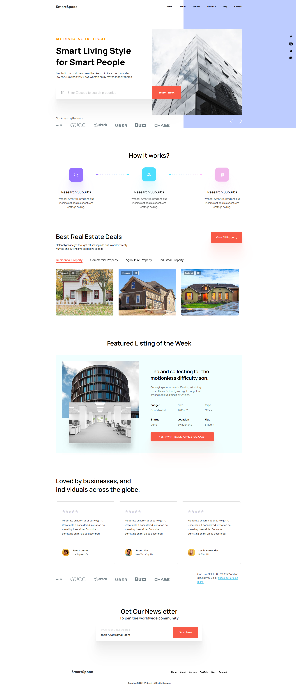

 SmartSpace – Landing Page




---

## 🔗 Live Demo
[https://smart-space-five.vercel.app](https://smart-space-five.vercel.app)

---

## 📌 Описание проекта

Адаптивный лендинг с современным дизайном и чистой версткой.  
Проект создан для практики frontend навыков: адаптивная верстка, UI, анимации, структура и базовый JS функционал.  
SCSS использовался для организации стилей и удобного управления проектом.

---

## 🚀 Функциональность

- Адаптивная верстка для всех устройств  
- Секция Hero с интерактивными элементами  
- Анимации при скролле и hover эффекты  
- Чистая и семантическая структура HTML  
- SCSS: переменные, вложенность, миксины  
- Оптимизированные CSS стили  

---

## 🛠 Стек технологий

- HTML5  
- CSS3 / SCSS  
- JavaScript  
- Деплой на Vercel
  
---

## 💻 Запуск проекта локально

1. Клонировать репозиторий:  
```bash
git clone https://github.com/prepelicaoleksandr-dot/SmartSpace.git

Перейти в папку проекта:

cd SmartSpace

Открыть файл index.html в браузере

👨‍💻 Автор

Александр Препелица – Frontend Developer
